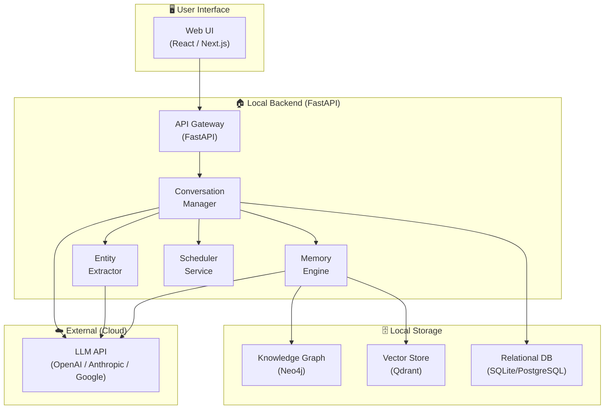
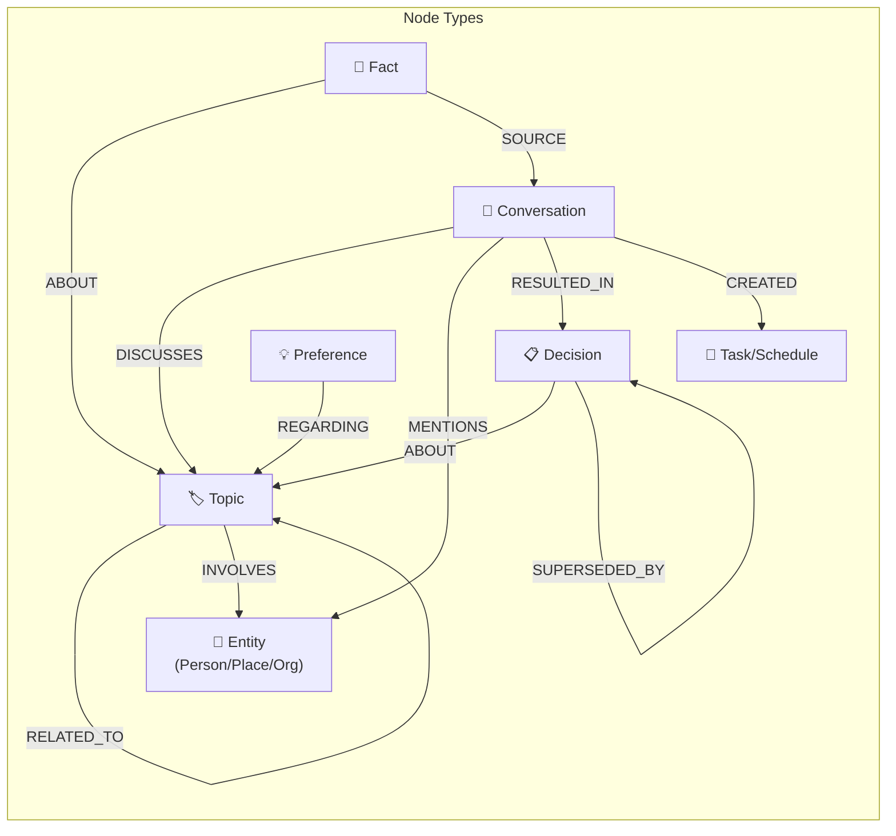
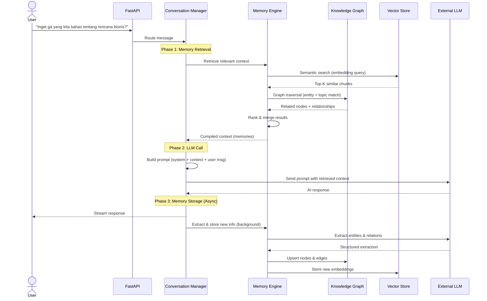
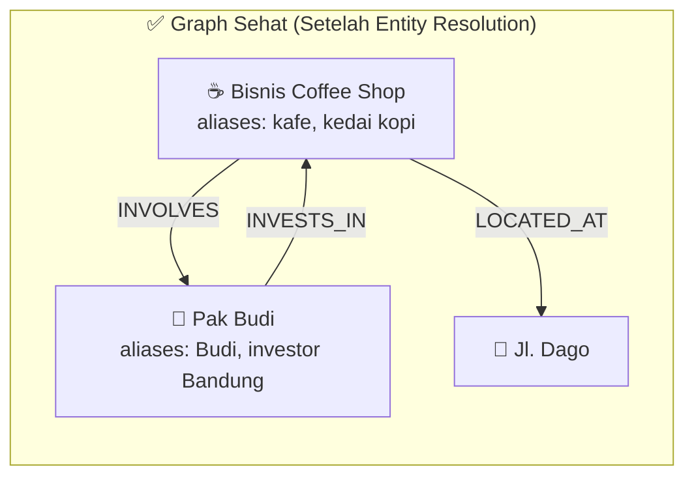
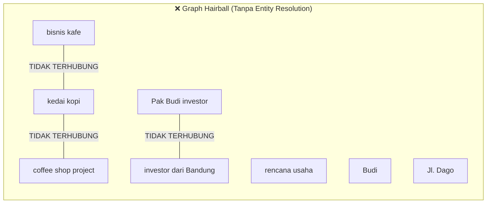

# 🧠 Personal AI Assistant — Technical Planning Document

> **Project Codename**: *Personia* (atau nama lain sesuai preferensi)
> **Author**: Nafiz
> **Date**: 31 Agustus 2026
> **Status**: Planning Phase

---

## 1. Executive Summary

Project ini adalah **AI Personal Assistant** yang berjalan secara lokal (self-hosted) dengan kemampuan **long-term memory** berbasis **Knowledge Graph**. Tujuan utamanya adalah menjadi partner brainstorming sehari-hari yang **benar-benar mengingat konteks** dari percakapan sebelumnya — bukan sekadar chatbot stateless.

**Pembeda utama dari chatbot biasa:**
- Mampu mengingat diskusi dari minggu/bulan lalu tanpa perlu scroll history
- Memahami relasi antar topik yang pernah dibahas
- Bisa dipanggil dengan referensi natural: *"Inget ga yang kita bahas tentang rencana bisnis kemarin?"*
- Tidak perlu menelusuri seluruh riwayat — cukup query Knowledge Graph

**Prinsip arsitektur:**
- 🏠 **Full Local** — semua data, database, dan processing berjalan di mesin lokal
- 🌐 **External LLM Only** — satu-satunya komponen cloud adalah API LLM (untuk mendapatkan model parameter tinggi)
- 🔒 **Privacy First** — data pribadi tidak pernah meninggalkan mesin kecuali prompt ke LLM

---

## 2. Problem Statement & Motivation

### 2.1 Masalah dengan AI Chatbot Saat Ini

| Masalah | Dampak |
|---------|--------|
| **Stateless by default** | Setiap conversation baru = AI lupa semua konteks |
| **Context window terbatas** | Bahkan dalam 1 sesi, setelah ~128K token, konteks awal hilang |
| **Full history scan mahal** | Mengirim seluruh riwayat ke LLM = biaya token tinggi + latency |
| **Tidak ada relasi antar topik** | AI tidak bisa menghubungkan diskusi A dengan diskusi B |
| **Tidak ada temporal awareness** | AI tidak tahu kapan sesuatu dibahas, tidak bisa bilang "2 minggu lalu kita bahas X" |

### 2.2 Solusi: Knowledge Graph sebagai Long-Term Memory

Knowledge Graph menyimpan informasi dalam bentuk **nodes** (entitas) dan **edges** (relasi), sehingga:
- Query bisa sangat targeted — ambil hanya nodes yang relevan
- Relasi antar topik tersimpan secara eksplisit
- Temporal metadata (kapan dibahas) tersimpan di setiap node/edge
- Tidak perlu scan seluruh history — cukup traverse graph

---

## 3. Scope & Batasan

### 3.1 Dalam Scope ✅

| Fitur | Deskripsi |
|-------|-----------|
| **Conversational AI** | Tanya jawab, brainstorming, diskusi sehari-hari |
| **Long-term Memory** | Mengingat topik, keputusan, preferensi dari percakapan lalu |
| **Contextual Recall** | "Inget ga yang kita bahas tentang X?" → AI bisa jawab |
| **Jadwal & Reminder** | Catat jadwal, meeting, deadline |
| **Topic Linking** | Menghubungkan topik-topik yang saling berkaitan |
| **Summarization** | Ringkasan otomatis dari percakapan panjang |
| **Semantic Search** | Cari informasi berdasarkan makna, bukan keyword exact |

### 3.2 Di Luar Scope ❌

| Fitur | Alasan |
|-------|--------|
| Code generation / coding assistant | Terlalu berat, sudah ada tool khusus |
| Multi-user support | Ini personal assistant, single user |
| Mobile app (phase 1) | Fokus web-based dulu |
| Voice interaction (phase 1) | Bisa ditambahkan di fase berikutnya |
| Real-time collaboration | Single user, tidak perlu |

---

## 4. System Architecture

### 4.1 High-Level Architecture



### 4.2 Component Breakdown

#### 4.2.1 API Gateway (FastAPI)
- Entry point untuk semua request dari frontend
- Routing, authentication (local), rate limiting
- WebSocket support untuk streaming response dari LLM

#### 4.2.2 Conversation Manager
- Mengelola lifecycle setiap conversation session
- Menerima user message → orchestrate pipeline → return response
- Menyimpan raw conversation ke relational DB

#### 4.2.3 Memory Engine (Core Component ⭐)
- **Retrieval**: Query Knowledge Graph + Vector Store untuk mengambil konteks relevan
- **Storage**: Setelah conversation selesai, extract & simpan informasi baru ke Knowledge Graph
- **Ranking**: Scoring relevansi dari retrieved memories berdasarkan recency, importance, dan similarity
- **Compression**: Summarize old memories untuk menghemat storage

#### 4.2.4 Entity Extractor
- Extract entitas (orang, tempat, topik, keputusan, tanggal) dari percakapan
- Bisa menggunakan combination of:
  - **LLM-based extraction** (lebih akurat, tapi ada latency + cost)
  - **Local NLP** (spaCy / stanza) untuk basic NER sebagai fallback
- Output: structured entities + relationships → disimpan ke Knowledge Graph

#### 4.2.5 Scheduler Service
- Background job untuk:
  - Reminder/alarm yang sudah di-set user
  - Periodic memory consolidation (merge/summarize old memories)
  - Knowledge Graph maintenance (prune orphan nodes, recalculate importance)

---

## 5. Knowledge Graph Design (Detail)

### 5.1 Mengapa Knowledge Graph?

Dibandingkan alternatif lain untuk long-term memory:

| Pendekatan | Pros | Cons |
|-----------|------|------|
| **Full history ke LLM** | Simple | Mahal, slow, context window limit |
| **Vector DB only** | Semantic search bagus | Tidak ada relasi eksplisit antar topik |
| **Relational DB only** | Structured | Tidak bisa traverse relationship dengan natural |
| **Knowledge Graph** ✅ | Relasi eksplisit, traversal cepat, temporal | Setup lebih complex |
| **Knowledge Graph + Vector DB** ✅✅ | Best of both worlds | Paling complex, tapi paling powerful |

**Keputusan: Hybrid approach — Knowledge Graph (Neo4j) + Vector Store (Qdrant)**

### 5.2 Graph Schema Design



### 5.3 Node Properties (Detail)

#### Topic Node
```
{
  id: UUID,
  name: "Rencana Bisnis Coffee Shop",
  description: "Diskusi tentang membuka coffee shop di daerah Bandung",
  category: "business",           // business, personal, learning, health, etc.
  importance_score: 0.85,         // 0-1, dihitung berdasarkan frequency + recency
  first_mentioned: "2026-08-15",
  last_mentioned: "2026-08-31",
  mention_count: 5,
  summary: "Rencana buka coffee shop di Bandung...",  // auto-generated summary
  embedding_id: "chroma_xxx"      // reference ke vector di Qdrant
}
```

#### Conversation Node
```
{
  id: UUID,
  title: "Brainstorming Coffee Shop",   // auto-generated
  started_at: "2026-08-31T10:00:00",
  ended_at: "2026-08-31T10:45:00",
  message_count: 24,
  summary: "Diskusi tentang lokasi dan modal...",
  mood: "productive",                    // optional sentiment
  embedding_id: "chroma_yyy"
}
```

#### Decision Node
```
{
  id: UUID,
  content: "Pilih lokasi di Jl. Dago karena traffic tinggi",
  decided_at: "2026-08-31",
  confidence: "firm",            // tentative | firm | revised
  context: "Setelah bandingkan 3 lokasi...",
  superseded: false
}
```

#### Task/Schedule Node
```
{
  id: UUID,
  title: "Meeting dengan investor",
  description: "Presentasi business plan coffee shop",
  due_date: "2026-09-15T14:00:00",
  status: "pending",            // pending | in_progress | done | cancelled
  priority: "high",
  recurrence: null               // daily | weekly | monthly | null
}
```

#### Preference Node
```
{
  id: UUID,
  key: "preferred_meeting_time",
  value: "pagi, antara jam 9-11",
  learned_from: "conversation_xxx",
  confidence: 0.9
}
```

### 5.4 Edge/Relationship Types

| Relationship | From → To | Properties |
|-------------|-----------|------------|
| `DISCUSSES` | Conversation → Topic | weight (seberapa dalam dibahas) |
| `MENTIONS` | Conversation → Entity | count, sentiment |
| `RELATED_TO` | Topic → Topic | strength (0-1), relationship_type |
| `RESULTED_IN` | Conversation → Decision | — |
| `SUPERSEDED_BY` | Decision → Decision | reason |
| `CREATED` | Conversation → Task | — |
| `INVOLVES` | Topic → Entity | role |
| `ABOUT` | Decision/Fact/Preference → Topic | — |
| `FOLLOWS_UP` | Conversation → Conversation | — |
| `SOURCE` | Fact → Conversation | — |

### 5.5 Contoh Query Patterns

**User bilang**: *"Inget ga yang kita bahas tentang rencana bisnis?"*

```cypher
// 1. Cari Topic node yang match
MATCH (t:Topic)
WHERE t.name CONTAINS 'rencana bisnis' OR t.category = 'business'

// 2. Ambil conversations terkait + decisions
MATCH (c:Conversation)-[:DISCUSSES]->(t)
OPTIONAL MATCH (c)-[:RESULTED_IN]->(d:Decision)-[:ABOUT]->(t)

// 3. Return sorted by recency
RETURN t, c, d ORDER BY c.started_at DESC LIMIT 5
```

**User bilang**: *"Apa aja keputusan yang udah kita buat bulan ini?"*

```cypher
MATCH (d:Decision)
WHERE d.decided_at >= '2026-08-01'
MATCH (d)-[:ABOUT]->(t:Topic)
RETURN d, t ORDER BY d.decided_at DESC
```

---

## 6. Memory Pipeline (How It All Works)

### 6.1 Conversation Flow — Step by Step



### 6.2 Memory Retrieval Strategy

Saat user mengirim pesan, Memory Engine melakukan **3-layer retrieval**:

#### Layer 1: Semantic Search (Vector Store)
- Embed user message menggunakan local embedding model (e.g., `all-MiniLM-L6-v2`)
- Query Qdrant untuk top-K similar conversation chunks
- **Kelebihan**: Menangkap kesamaan makna meskipun kata-kata berbeda
- **Latency**: ~50-100ms

#### Layer 2: Graph Traversal (Knowledge Graph)
- Extract keywords/entities dari user message (bisa pakai simple NLP atau LLM)
- Match ke Topic/Entity nodes di Neo4j
- Traverse 1-2 hop untuk ambil related nodes (Decisions, Facts, dll)
- **Kelebihan**: Menangkap relasi eksplisit dan konteks terstruktur
- **Latency**: ~30-80ms

#### Layer 3: Recency & Importance Scoring
- Gabungkan hasil Layer 1 & Layer 2
- Score setiap memory berdasarkan:
  - **Recency**: Kapan terakhir dibahas (decay function)
  - **Importance**: Seberapa penting topik ini (dari importance_score)
  - **Relevance**: Seberapa match dengan query saat ini (dari similarity score)
  - **Frequency**: Seberapa sering topik ini muncul
- Formula: `final_score = α·relevance + β·recency + γ·importance + δ·frequency`
- Select top-N memories untuk dikirim sebagai konteks ke LLM

### 6.3 Memory Storage Pipeline (Post-Conversation)

Setelah AI merespons, background process berjalan:

1. **Chunking**: Pecah conversation menjadi meaningful chunks
2. **Entity Extraction**: Gunakan LLM untuk extract:
   - Topics yang dibahas (new or existing)
   - Entities yang disebutkan (people, places, orgs)
   - Decisions yang dibuat
   - Tasks/schedules yang di-set
   - Facts yang disebutkan
   - Preferences yang terungkap
3. **Graph Update**:
   - Upsert nodes (create baru atau update existing)
   - Create/strengthen edges
   - Update importance scores
   - Update temporal metadata
4. **Vector Update**:
   - Generate embeddings untuk conversation chunks
   - Store di Qdrant dengan metadata

### 6.4 Memory Consolidation (Periodic)

Untuk mencegah graph membengkak:

| Proses | Frekuensi | Deskripsi |
|--------|-----------|-----------|
| **Summarize old conversations** | Weekly | Conversations > 30 hari di-summarize, detail dihapus |
| **Merge similar topics** | Weekly | Topics yang overlap di-merge menjadi satu |
| **Decay importance** | Daily | Topik yang lama tidak dibahas, importance score berkurang |
| **Prune orphans** | Monthly | Nodes tanpa relationship dihapus |
| **Re-embed summaries** | After consolidation | Update vectors setelah summarization |

---

## 7. Tech Stack (Detail)

### 7.1 Backend

| Component | Technology | Alasan |
|-----------|-----------|--------|
| **Framework** | FastAPI | Async-native, Python ecosystem, WebSocket support |
| **Language** | Python 3.11+ | Ekosistem AI/ML terbaik |
| **Task Queue** | Celery + Redis / APScheduler | Background jobs (entity extraction, consolidation) |
| **WebSocket** | FastAPI WebSocket | Streaming LLM responses |

### 7.2 Data Storage (Semua Local)

| Component | Technology | Alasan |
|-----------|-----------|--------|
| **Knowledge Graph** | **Neo4j Community Edition** | Gratis, mature, Cypher query language powerful, local deployment mudah |
| **Vector Store** | **Qdrant** | Pure Python, embedded mode (no server needed), lightweight |
| **Relational DB** | **SQLite** (start) → **PostgreSQL** (scale) | Raw conversations, user settings, session management |
| **Embedding Model** | **sentence-transformers** (`all-MiniLM-L6-v2`) | Runs locally, 80MB model, fast inference |

> [!NOTE]
> **Mengapa Neo4j Community Edition?**
> - Gratis dan open-source
> - Mendukung deployment local via Docker atau standalone
> - Cypher query language sangat expressive untuk graph traversal
> - Community besar, dokumentasi lengkap
> - Alternatif: **FalkorDB** (Redis-based, lebih ringan) atau **Memgraph** (in-memory, lebih cepat)

> [!NOTE]
> **Mengapa Qdrant untuk Vector Store?**
> - Bisa berjalan embedded (tanpa server terpisah) — `from qdrant_client import QdrantClient; client = QdrantClient(path="./qdrant_data")`
> - Persistent storage ke disk
> - Sangat ringan untuk use case personal (< 100K vectors)
> - Alternatif: **FAISS** (Facebook, lebih mature tapi lower-level), **Qdrant** (lebih feature-rich tapi perlu server)

### 7.3 External Services

| Component | Technology | Alasan |
|-----------|-----------|--------|
| **LLM** | **OpenAI GPT-4o / Anthropic Claude / Google Gemini** | Parameter tinggi, reasoning kuat |
| **Fallback LLM** | Bisa disiapkan secondary provider | Redundancy |

> [!IMPORTANT]
> **Strategi LLM API**:
> - Gunakan abstraction layer (e.g., LiteLLM) agar bisa switch provider tanpa ubah kode
> - Implement retry + fallback antar provider
> - Cache responses untuk pertanyaan yang identik/mirip
> - Monitor token usage untuk kontrol biaya

### 7.4 Frontend

| Component | Technology | Alasan |
|-----------|-----------|--------|
| **Framework** | **React** (Next.js atau Vite) | Modern, component-based |
| **Styling** | **Tailwind CSS** atau **Vanilla CSS** | Rapid prototyping |
| **State Management** | **Zustand** atau **React Context** | Lightweight |
| **Markdown Rendering** | **react-markdown** | Render AI responses yang formatted |

### 7.5 Infrastructure (Local)

| Component | Technology | Alasan |
|-----------|-----------|--------|
| **Containerization** | **Docker Compose** | Neo4j + Backend + Frontend dalam satu command |
| **Process Manager** | **Docker Compose** / **Supervisor** | Manage semua services |

---

## 8. Database Schema (Relational — SQLite/PostgreSQL)

Selain Knowledge Graph, kita tetap butuh relational DB untuk data terstruktur:

### 8.1 Tables

```sql
-- Raw conversation storage
CREATE TABLE conversations (
    id UUID PRIMARY KEY,
    title VARCHAR(255),          -- Auto-generated
    started_at TIMESTAMP NOT NULL,
    ended_at TIMESTAMP,
    message_count INTEGER DEFAULT 0,
    summary TEXT,                 -- Auto-generated after conversation ends
    is_archived BOOLEAN DEFAULT FALSE,
    created_at TIMESTAMP DEFAULT NOW(),
    updated_at TIMESTAMP DEFAULT NOW()
);

-- Individual messages
CREATE TABLE messages (
    id UUID PRIMARY KEY,
    conversation_id UUID REFERENCES conversations(id),
    role VARCHAR(20) NOT NULL,   -- 'user' | 'assistant' | 'system'
    content TEXT NOT NULL,
    token_count INTEGER,
    created_at TIMESTAMP DEFAULT NOW()
);

-- User preferences & settings
CREATE TABLE user_settings (
    key VARCHAR(100) PRIMARY KEY,
    value JSONB NOT NULL,
    updated_at TIMESTAMP DEFAULT NOW()
);

-- Scheduled tasks & reminders
CREATE TABLE schedules (
    id UUID PRIMARY KEY,
    title VARCHAR(255) NOT NULL,
    description TEXT,
    due_date TIMESTAMP,
    recurrence VARCHAR(50),       -- 'daily' | 'weekly' | 'monthly' | cron expression
    status VARCHAR(20) DEFAULT 'pending',
    priority VARCHAR(20) DEFAULT 'medium',
    source_conversation_id UUID REFERENCES conversations(id),
    created_at TIMESTAMP DEFAULT NOW(),
    updated_at TIMESTAMP DEFAULT NOW()
);

-- LLM API usage tracking
CREATE TABLE llm_usage_log (
    id UUID PRIMARY KEY,
    provider VARCHAR(50),         -- 'openai' | 'anthropic' | 'google'
    model VARCHAR(100),
    prompt_tokens INTEGER,
    completion_tokens INTEGER,
    total_cost DECIMAL(10, 6),
    conversation_id UUID REFERENCES conversations(id),
    created_at TIMESTAMP DEFAULT NOW()
);
```

---

## 9. API Design

### 9.1 REST Endpoints

```
# Conversations
POST   /api/v1/chat                    # Send message & get response (streaming)
GET    /api/v1/conversations           # List all conversations
GET    /api/v1/conversations/{id}      # Get conversation detail + messages
DELETE /api/v1/conversations/{id}      # Delete conversation
PATCH  /api/v1/conversations/{id}      # Update conversation (title, archive)

# Memory / Knowledge
GET    /api/v1/memory/search           # Search memories (semantic + graph)
GET    /api/v1/memory/topics           # List all topics in knowledge graph
GET    /api/v1/memory/topics/{id}      # Get topic detail + related info
GET    /api/v1/memory/graph            # Get graph visualization data
DELETE /api/v1/memory/topics/{id}      # Forget a topic

# Schedules
GET    /api/v1/schedules               # List schedules/reminders
POST   /api/v1/schedules               # Create schedule manually
PATCH  /api/v1/schedules/{id}          # Update schedule
DELETE /api/v1/schedules/{id}          # Delete schedule

# Settings
GET    /api/v1/settings                # Get all settings
PATCH  /api/v1/settings                # Update settings

# System
GET    /api/v1/system/health           # Health check
GET    /api/v1/system/stats            # Usage statistics (tokens, memories, etc.)
```

### 9.2 WebSocket Endpoint

```
WS /api/v1/chat/stream
```

Untuk real-time streaming response dari LLM. Flow:
1. Client kirim message via WebSocket
2. Server stream response token-by-token
3. Setelah complete, server kirim `[DONE]` signal
4. Background: entity extraction & memory storage berjalan async

---

## 10. Prompt Engineering Strategy

### 10.1 System Prompt Structure

```
[SYSTEM PROMPT]
├── Role Definition (siapa AI ini)
├── Behavioral Guidelines (cara bicara, batasan)
├── Current Date & Time
├── User Profile (preferences yang dipelajari)
│
├── [RETRIEVED MEMORIES]     ← dari Memory Engine
│   ├── Related Topics & Summaries
│   ├── Recent Decisions
│   ├── Relevant Facts
│   └── Active Tasks/Schedules
│
├── [RECENT CONVERSATION]    ← current session messages
│
└── [USER MESSAGE]           ← pesan terbaru dari user
```

### 10.2 Contoh System Prompt

```markdown
Kamu adalah asisten pribadi Nafiz. Kamu membantu brainstorming, diskusi,
dan manajemen jadwal sehari-hari. Kamu BUKAN coding assistant.

## Konteks yang Kamu Ketahui

### Topik yang Pernah Dibahas (relevan dengan pesan user saat ini):
1. **Rencana Bisnis Coffee Shop** (terakhir dibahas: 28 Aug 2026)
   - Lokasi: Jl. Dago, Bandung
   - Keputusan: Budget max 500jt
   - Status: Masih tahap riset

2. **Persiapan Interview Google** (terakhir dibahas: 25 Aug 2026)
   - Fokus: System Design
   - Jadwal: 15 Sep 2026

### Jadwal Mendatang:
- Meeting dengan investor: 15 Sep 2026 14:00
- Deadline proposal: 10 Sep 2026

### Preferensi Nafiz:
- Suka diskusi mendalam, bukan jawaban pendek
- Prefer meeting pagi (9-11)
- Bahasa: campur Indonesia-English

## Instruksi:
- Jawab sesuai konteks di atas jika relevan
- Jika user menyebut topik yang pernah dibahas, referensikan dari konteks
- Jika ada informasi baru, catat (akan di-extract oleh system)
- Jangan pura-pura ingat sesuatu yang tidak ada di konteks
```

### 10.3 Entity Extraction Prompt

Setelah conversation, LLM dipanggil dengan prompt khusus untuk extract informasi:

```markdown
Analyze the following conversation and extract structured information.

Return JSON with:
{
  "topics": [{"name": "...", "category": "...", "summary": "..."}],
  "entities": [{"name": "...", "type": "person|place|org", "context": "..."}],
  "decisions": [{"content": "...", "confidence": "tentative|firm"}],
  "tasks": [{"title": "...", "due_date": "...", "priority": "..."}],
  "facts": [{"content": "...", "about_topic": "..."}],
  "preferences": [{"key": "...", "value": "..."}],
  "topic_relations": [{"from": "...", "to": "...", "relation": "..."}]
}
```

---

## 11. Long-Term Sustainability: Bottleneck Analysis & Solusi

> [!IMPORTANT]
> Section ini menjawab pertanyaan kritis: **"Apakah project ini bisa bertahan jangka panjang?"**
> Jawabannya: **Ya, sangat bisa** — asalkan bottleneck-bottleneck berikut di-address sejak awal dalam arsitektur.

### 11.0 Proyeksi Pertumbuhan Data (1 Tahun)

Sebelum membahas bottleneck, mari kita lihat estimasi realistis seberapa besar data yang terakumulasi setelah pemakaian intensif selama **1 tahun (365 hari)**:

| Metrik | Asumsi Harian | 1 Bulan | 6 Bulan | 1 Tahun |
|--------|--------------|---------|---------|---------|
| **Pesan (user + AI)** | ~100 pesan | 3.000 | 18.000 | 36.500 |
| **Conversations** | ~5 sesi | 150 | 900 | 1.825 |
| **Topic nodes** | ~5 topik baru (setelah dedup) | 150 | 900 | 1.825 |
| **Entity nodes** | ~10 entitas baru | 300 | 1.800 | 3.650 |
| **Decision nodes** | ~2 keputusan | 60 | 360 | 730 |
| **Fact nodes** | ~5 fakta baru | 150 | 900 | 1.825 |
| **Preference nodes** | ~1 preferensi | 30 | 180 | 365 |
| **Total Nodes** | — | ~700 | ~4.000 | **~8.400** |
| **Total Edges/Relationships** | ~30 relasi baru | 900 | 5.400 | **~11.000** |
| **Vector embeddings** | ~20 chunks | 600 | 3.600 | **~7.300** |
| **SQLite storage** | — | ~2 MB | ~10 MB | **~20 MB** |
| **Qdrant storage** | — | ~15 MB | ~80 MB | **~150 MB** |
| **Neo4j storage** | — | ~5 MB | ~25 MB | **~50 MB** |

> [!NOTE]
> **Kesimpulan ukuran data**: Setelah 1 tahun pemakaian intensif, total storage hanya sekitar **~220 MB**. Neo4j didesain untuk menangani **jutaan hingga miliaran node** — 8.400 node itu ibarat sebutir debu. Dari segi *database capacity*, sistem ini bisa bertahan **puluhan tahun** tanpa masalah.
>
> **Bottleneck bukan di storage, tapi di kualitas data dan efisiensi retrieval.**

---

### 11.1 🔴 Bottleneck #1: "The Graph Hairball" — Entity Duplication & Graph Fragmentation

**Severity**: 🔴 **CRITICAL** — Ini bottleneck **paling berbahaya** dan harus di-solve sejak awal.

#### Masalah

Seiring waktu, user akan menyebut hal yang sama dengan cara yang berbeda-beda di percakapan yang berbeda:

| Bulan ke-1 | Bulan ke-6 | Bulan ke-12 |
|-----------|-----------|------------|
| "bisnis kafe" | "kedai kopi" | "coffee shop project" |
| "rencana usaha" | "business plan" | "entrepreneurship plan" |
| "Pak Budi investor" | "investor dari Bandung" | "Budi" |

Karena LLM mengekstrak entitas **secara independen di setiap percakapan**, Neo4j akan membuat **node terpisah** untuk setiap sebutan — meskipun sebenarnya merujuk ke hal yang sama.

**Dampak setelah 1 tahun:**
- Graph menjadi **"bola rambut" (hairball)** — banyak node yang seharusnya satu, terpecah menjadi puluhan fragment
- Saat user tanya *"Inget ga yang kita bahas tentang bisnis kafe?"*, Memory Engine mungkin hanya menemukan **1 dari 5 node** yang relevan
- Relasi antar topik **terputus** karena node-node yang terfragmentasi tidak terhubung satu sama lain
- **Recall accuracy turun drastis** dari bulan ke bulan — ini yang membuat sistem terasa "makin bodoh" seiring waktu

#### Ilustrasi: Graph yang Sehat vs. Graph yang Fragmented





#### Solusi: Multi-Layer Entity Resolution Pipeline

**Layer 1 — Real-time Check (Saat Extraction)**

Setiap kali Entity Extractor mau membuat node baru, lakukan pengecekan dulu:

```python
# Pseudocode: Pre-insertion dedup check
async def resolve_entity(new_entity: ExtractedEntity) -> str:
    """Cek apakah entity ini sudah ada di graph. Return existing node ID atau create baru."""

    # Step 1: Exact match (nama persis sama, case-insensitive)
    existing = await neo4j.query(
        "MATCH (n) WHERE toLower(n.name) = toLower($name) RETURN n",
        name=new_entity.name
    )
    if existing:
        return existing.id  # Langsung pakai node yang ada

    # Step 2: Alias match (cek apakah nama ini sudah terdaftar sebagai alias)
    alias_match = await neo4j.query(
        "MATCH (n) WHERE $name IN n.aliases RETURN n",
        name=new_entity.name.lower()
    )
    if alias_match:
        return alias_match.id

    # Step 3: Semantic similarity (embedding comparison)
    similar_nodes = await qdrant_client.query(
        collection="entity_embeddings",
        query_text=new_entity.name,
        n_results=5,
        where={"type": new_entity.type}  # filter by same type
    )

    # Step 4: Jika ada yang sangat mirip (similarity > 0.85), minta LLM konfirmasi
    for candidate in similar_nodes:
        if candidate.similarity > 0.85:
            is_same = await llm.ask(
                f"Apakah '{new_entity.name}' dan '{candidate.name}' "
                f"merujuk ke hal/orang/tempat yang sama? "
                f"Konteks A: {new_entity.context}. "
                f"Konteks B: {candidate.context}. "
                f"Jawab hanya 'ya' atau 'tidak'."
            )
            if is_same == "ya":
                # Merge: tambahkan nama baru sebagai alias
                await neo4j.query(
                    "MATCH (n) WHERE n.id = $id "
                    "SET n.aliases = n.aliases + $alias",
                    id=candidate.id, alias=new_entity.name.lower()
                )
                return candidate.id

    # Step 5: Jika tidak ada match → create new node
    return await create_new_entity_node(new_entity)
```

**Layer 2 — Weekly Consolidation Job (Background)**

Meskipun ada real-time check, beberapa duplikat pasti lolos. Oleh karena itu, jalankan **weekly background job** yang menyisir seluruh graph:

```python
# Pseudocode: Weekly dedup sweep
async def weekly_entity_consolidation():
    """Scan seluruh graph untuk menemukan dan merge node yang duplikat."""

    # 1. Ambil semua node, group by type
    all_topics = await neo4j.query("MATCH (t:Topic) RETURN t")

    # 2. Untuk setiap pair, hitung semantic similarity
    for i, topic_a in enumerate(all_topics):
        for topic_b in all_topics[i+1:]:
            similarity = cosine_similarity(
                get_embedding(topic_a.name + " " + topic_a.summary),
                get_embedding(topic_b.name + " " + topic_b.summary)
            )

            if similarity > 0.80:
                # 3. Konfirmasi via LLM (pakai model murah: GPT-4o-mini)
                should_merge = await llm_cheap.ask(
                    f"Apakah topik berikut adalah hal yang sama?\n"
                    f"A: {topic_a.name} - {topic_a.summary}\n"
                    f"B: {topic_b.name} - {topic_b.summary}\n"
                    f"Jawab 'ya' atau 'tidak' dengan alasan singkat."
                )

                if should_merge:
                    await merge_nodes(topic_a, topic_b)

async def merge_nodes(primary, duplicate):
    """Merge duplicate node ke primary node."""
    # 1. Transfer semua relationships dari duplicate ke primary
    await neo4j.query("""
        MATCH (dup)-[r]->(target)
        WHERE dup.id = $dup_id
        MERGE (primary)-[r2:SAME_TYPE_AS_R]->(target)
        SET r2 = properties(r)
        DELETE r
    """, dup_id=duplicate.id, primary_id=primary.id)

    # 2. Transfer inbound relationships juga
    await neo4j.query("""
        MATCH (source)-[r]->(dup)
        WHERE dup.id = $dup_id
        MERGE (source)-[r2:SAME_TYPE_AS_R]->(primary)
        SET r2 = properties(r)
        DELETE r
    """, dup_id=duplicate.id, primary_id=primary.id)

    # 3. Merge properties (nama duplicate jadi alias)
    await neo4j.query("""
        MATCH (primary) WHERE primary.id = $primary_id
        MATCH (dup) WHERE dup.id = $dup_id
        SET primary.aliases = primary.aliases + dup.name
        SET primary.mention_count = primary.mention_count + dup.mention_count
        SET primary.summary = primary.summary + ' | ' + dup.summary
        DELETE dup
    """, primary_id=primary.id, dup_id=duplicate.id)
```

**Layer 3 — Alias System (Node Property)**

Setiap node punya `aliases` array yang terus bertambah seiring waktu:

```
Topic Node: {
    id: "uuid-xxx",
    name: "Bisnis Coffee Shop",                    // canonical name
    aliases: ["bisnis kafe", "kedai kopi",          // accumulated aliases
              "coffee shop project", "rencana usaha kopi"],
    ...
}
```

Saat retrieval, query akan match terhadap **name DAN seluruh aliases**:

```cypher
MATCH (t:Topic)
WHERE toLower(t.name) CONTAINS toLower($query)
   OR ANY(alias IN t.aliases WHERE alias CONTAINS toLower($query))
RETURN t
```

---

### 11.2 🔴 Bottleneck #2: Context Window Overflow

**Severity**: 🔴 **CRITICAL** — Langsung mempengaruhi kualitas jawaban AI dan biaya API.

#### Masalah

Bayangkan setelah 1 tahun, kamu sudah sering membahas topik "Investasi Saham" — setidaknya seminggu sekali, total ~50 percakapan. Saat kamu tanya *"Gimana portofolio saham gw sekarang?"*, Memory Engine akan menemukan:

- 50 Conversation nodes terkait investasi
- 30 Decision nodes tentang beli/jual saham
- 80 Fact nodes tentang harga, analisis, dll
- 20 Entity nodes (nama saham, broker, dll)

Kalau **semua** ini di-dump ke prompt LLM:

| Data | Est. Token Count |
|------|-----------------|
| 50 conversation summaries (masing-masing ~200 token) | 10.000 tokens |
| 30 decisions (masing-masing ~50 token) | 1.500 tokens |
| 80 facts (masing-masing ~30 token) | 2.400 tokens |
| System prompt + instructions | 1.000 tokens |
| Current conversation messages | 2.000 tokens |
| **Total** | **~17.000 tokens** |

Ini belum melebihi context window (128K), tapi:
- **Biaya per chat**: 17K input tokens × $2.50/1M = $0.04 per chat. Kalau 50 chat/hari = **$2/hari = $60/bulan** hanya untuk input tokens
- **Noise**: Sebagian besar dari 50 percakapan saham itu sudah tidak relevan (harga saham 6 bulan lalu tidak berguna)
- **LLM confusion**: Terlalu banyak konteks justru membuat LLM bingung dan kehilangan fokus — fenomena ini disebut *"Lost in the Middle"*

#### Solusi: Hierarchical Memory dengan Token Budget System

**Konsep: 4-Tier Memory Hierarchy**

Sama seperti arsitektur memori di CPU (L1 Cache → L2 → L3 → RAM → Disk), kita desain memory dalam 4 tier:

```
┌─────────────────────────────────────────────┐
│  Tier 1: ACTIVE CONTEXT (~2000 tokens)      │
│  Pesan-pesan di conversation session ini     │
│  → Selalu masuk prompt, tidak di-filter      │
├─────────────────────────────────────────────┤
│  Tier 2: HOT MEMORY (~2000 tokens max)      │
│  Topik/keputusan yang LANGSUNG relevan       │
│  dengan pesan user saat ini                  │
│  → Retrieved via semantic search + graph     │
│  → Full detail (summaries + key facts)       │
├─────────────────────────────────────────────┤
│  Tier 3: WARM MEMORY (~1000 tokens max)     │
│  Topik terkait yang mungkin relevan          │
│  → 1-2 kalimat summary saja                 │
│  → "Kamu juga pernah bahas X dan Y"         │
├─────────────────────────────────────────────┤
│  Tier 4: COLD MEMORY (tidak masuk prompt)   │
│  Semua data lama yang tidak relevan          │
│  → Tetap tersimpan di Neo4j + Qdrant      │
│  → Bisa di-recall jika user explicitly ask   │
└─────────────────────────────────────────────┘
```

**Token Budget Allocation:**

```python
# configs/memory_budget.py
MEMORY_TOKEN_BUDGET = {
    "system_prompt": 500,          # Role definition, instructions
    "user_profile": 300,           # Learned preferences
    "active_schedules": 200,       # Upcoming tasks/meetings
    "tier1_active_context": 2000,  # Current session messages
    "tier2_hot_memory": 2000,      # Directly relevant memories
    "tier3_warm_memory": 1000,     # Peripherally relevant context
    "buffer_for_response": 2000,   # Reserved for AI response
    # Total: ~8000 tokens per chat — sangat hemat
}
```

**Retrieval Logic dengan Budget:**

```python
async def retrieve_with_budget(user_message: str) -> ContextPayload:
    budget = MEMORY_TOKEN_BUDGET.copy()

    # 1. Tier 2: Hot Memory — ambil yang paling relevan
    hot_candidates = await memory_engine.retrieve(
        query=user_message,
        limit=20  # ambil 20 candidates
    )
    hot_memories = []
    tokens_used = 0
    for memory in hot_candidates:
        mem_tokens = count_tokens(memory.to_prompt_text())
        if tokens_used + mem_tokens <= budget["tier2_hot_memory"]:
            hot_memories.append(memory)
            tokens_used += mem_tokens
        else:
            break  # Budget habis

    # 2. Tier 3: Warm Memory — topik terkait tapi bukan primary match
    remaining_candidates = hot_candidates[len(hot_memories):]
    warm_memories = []
    tokens_used = 0
    for memory in remaining_candidates[:10]:
        # Hanya ambil 1-kalimat summary
        summary = memory.one_line_summary()
        mem_tokens = count_tokens(summary)
        if tokens_used + mem_tokens <= budget["tier3_warm_memory"]:
            warm_memories.append(summary)
            tokens_used += mem_tokens

    return ContextPayload(
        hot=hot_memories,
        warm=warm_memories,
        schedules=await get_active_schedules(),
        preferences=await get_user_preferences()
    )
```

**Dampak solusi ini:**
- Per-chat cost turun dari ~$0.04 menjadi ~**$0.005** (8x lebih hemat)
- LLM mendapat konteks yang **focused dan relevan** — jawaban lebih akurat
- Cold memory tetap tersimpan dan bisa dipanggil kapan saja

---

### 11.3 🟡 Bottleneck #3: Temporal Drift — Preferensi & Fakta yang Berubah Seiring Waktu

**Severity**: 🟡 **HIGH** — Menyebabkan AI memberikan informasi yang sudah *outdated*.

#### Masalah

Informasi tentang user **berubah seiring waktu**, tapi graph menyimpan semuanya tanpa membedakan mana yang masih valid dan mana yang sudah basi:

| Kapan | Apa yang User Bilang | Node yang Dibuat |
|-------|---------------------|-----------------|
| Jan 2026 | "Gw kerja di Startup ABC" | Fact: "Kerja di Startup ABC" |
| Apr 2026 | "Gw pindah ke perusahaan XYZ" | Fact: "Kerja di perusahaan XYZ" |
| Aug 2026 | "Gw lagi cari kerjaan baru" | Fact: "Sedang cari kerja" |

Sekarang saat user tanya *"Tolong buatin gw pitch tentang gw buat portfolio"*, AI bisa saja menjawab:
> *"Kamu bekerja di Startup ABC..."* ← **SALAH, informasi dari 8 bulan lalu**

**Dampak:**
- AI memberikan informasi **stale/basi** yang membingungkan user
- User kehilangan kepercayaan pada AI karena "koq dia nyebut info lama?"
- Semakin lama dipakai, semakin banyak informasi yang conflicting di graph

#### Solusi: Temporal Awareness System

**Solusi A — Relasi `SUPERSEDED_BY` untuk Decision & Fact**

Saat entity extraction menemukan informasi yang bertentangan dengan data existing, buat relasi `SUPERSEDED_BY`:

```cypher
// Sebelum: 2 fact node yang bertentangan, tidak terhubung
(f1:Fact {content: "Kerja di Startup ABC", created_at: "2026-01"})
(f2:Fact {content: "Kerja di perusahaan XYZ", created_at: "2026-04"})

// Sesudah: f1 ditandai sebagai superseded
(f1:Fact {content: "Kerja di Startup ABC", created_at: "2026-01", is_current: false})
  -[:SUPERSEDED_BY {reason: "User pindah kerja", superseded_at: "2026-04"}]->
(f2:Fact {content: "Kerja di perusahaan XYZ", created_at: "2026-04", is_current: true})
```

**Entity Extraction Prompt yang Temporal-Aware:**

```markdown
Analyze the conversation below. For each fact or preference you extract,
also check if it CONTRADICTS or UPDATES any of the following existing facts:

Existing Facts:
1. "Kerja di Startup ABC" (Jan 2026)
2. "Suka meeting pagi jam 9-11" (Mar 2026)
3. "Budget investasi max 10jt/bulan" (May 2026)

If a new fact updates/contradicts an existing one, mark it as:
{
  "content": "Kerja di perusahaan XYZ",
  "supersedes": "Kerja di Startup ABC",
  "reason": "User pindah kerja"
}
```

**Solusi B — Time-Decay Scoring saat Retrieval**

Saat Memory Engine menghitung relevance score, faktor **recency** harus dominan untuk data yang bersifat mutable (preferensi, fakta status):

```python
import math
from datetime import datetime, timedelta

def calculate_memory_score(memory, query_similarity: float) -> float:
    """
    Hitung final score untuk sebuah memory.
    Immutable facts (sejarah, event) tidak di-decay.
    Mutable facts (preferensi, status kerja) di-decay agresif.
    """
    # Base relevance dari semantic similarity (0-1)
    relevance = query_similarity

    # Recency decay
    days_ago = (datetime.now() - memory.last_mentioned).days
    if memory.is_mutable:
        # Mutable data: half-life 30 hari (decay cepat)
        recency = math.exp(-0.023 * days_ago)  # ln(2)/30 ≈ 0.023
    else:
        # Immutable data: half-life 365 hari (decay sangat lambat)
        recency = math.exp(-0.0019 * days_ago)  # ln(2)/365 ≈ 0.0019

    # Importance (dari graph: berapa banyak connections)
    importance = min(memory.mention_count / 20, 1.0)

    # Superseded penalty: jika sudah di-supersede, score = 0
    if memory.is_superseded:
        return 0.0

    # Final weighted score
    return (0.4 * relevance) + (0.35 * recency) + (0.25 * importance)
```

**Solusi C — `is_current` Flag pada Mutable Nodes**

Query retrieval selalu prioritaskan `is_current = true`:

```cypher
// Ambil hanya fakta yang masih berlaku
MATCH (f:Fact)-[:ABOUT]->(t:Topic)
WHERE t.name CONTAINS $query AND f.is_current = true
RETURN f ORDER BY f.created_at DESC
```

---

### 11.4 🟡 Bottleneck #4: Hidden API Cost — Biaya Kumulatif Entity Extraction

**Severity**: 🟡 **HIGH** — Tidak terasa di awal, tapi menumpuk signifikan dalam hitungan bulan.

#### Masalah

Setiap selesai percakapan, sistem memanggil LLM lagi untuk **entity extraction** (background job). Ini artinya setiap percakapan = **2x LLM call** (1 untuk chat, 1 untuk extraction).

**Estimasi biaya entity extraction selama 1 tahun:**

| Item | Kalkulasi | Biaya |
|------|----------|-------|
| Chat/hari | 50 pesan ÷ 10 pesan/sesi = 5 sesi/hari | — |
| Extraction call/sesi | Kirim full conversation (~2000 token) + extraction prompt (~500 token) | ~2500 input token |
| Extraction per hari | 5 sesi × 2500 token = 12.500 token | — |
| Extraction per bulan | 12.500 × 30 = 375.000 token | — |
| **Biaya/bulan (GPT-4o)** | 375K × $2.50/1M | **$0.94/bulan** |
| **Biaya/bulan (GPT-4o-mini)** | 375K × $0.15/1M | **$0.06/bulan** |
| **Weekly consolidation** | ~100 LLM calls/minggu (dedup + summarize) | ~$0.50/bulan (4o-mini) |

Total extraction + consolidation cost: **~$0.50 - $1.50/bulan** (dengan model tiering yang tepat).

Ditambah biaya **main chat**: **~$5-15/bulan** (tergantung intensitas).

> [!TIP]
> Dengan **model tiering** yang disiplin, total biaya bisa dijaga di kisaran **$7-15/bulan** — bahkan untuk pemakaian intensif.

#### Solusi: Model Tiering & Smart Extraction

**Solusi A — Model Tiering (Wajib)**

Bagi LLM calls menjadi tiers berdasarkan tugas:

```python
# configs/llm_config.py
LLM_TIERS = {
    # Tier 1: Main chat — model terbaik, user-facing
    "chat": {
        "provider": "anthropic",
        "model": "claude-sonnet-4-20250514",    # atau gpt-4o
        "max_tokens": 4096,
        "temperature": 0.7,
    },

    # Tier 2: Entity extraction — model murah, background
    "extraction": {
        "provider": "openai",
        "model": "gpt-4o-mini",                 # ~15x lebih murah dari GPT-4o
        "max_tokens": 2048,
        "temperature": 0.1,                      # low temp untuk structured output
    },

    # Tier 3: Consolidation tasks — model paling murah
    "consolidation": {
        "provider": "google",
        "model": "gemini-2.0-flash",            # sangat murah, cukup untuk summarize
        "max_tokens": 1024,
        "temperature": 0.1,
    },
}
```

**Solusi B — Conditional Extraction (Jangan Extract Setiap Chat)**

Tidak semua percakapan mengandung informasi baru yang perlu disimpan. Contoh:
- User: "Halo" / AI: "Halo juga!" → **TIDAK PERLU extraction**
- User: "Gw udah mutusin pilih lokasi Dago buat kafe" → **PERLU extraction**

```python
async def should_run_extraction(conversation: Conversation) -> bool:
    """Tentukan apakah conversation ini perlu entity extraction."""

    # Skip jika conversation terlalu pendek (small talk)
    if conversation.message_count < 4:
        return False

    # Skip jika total token terlalu sedikit
    total_tokens = sum(m.token_count for m in conversation.messages)
    if total_tokens < 200:
        return False

    # Quick check: apakah ada signal informasi baru?
    # (keyword-based, sangat murah — tanpa LLM call)
    info_signals = [
        "mutusin", "keputusan", "rencana", "jadwal", "deadline",
        "meeting", "prefer", "suka", "gak suka", "pindah",
        "decide", "plan", "schedule", "remind", "ingetin",
    ]
    all_text = " ".join(m.content for m in conversation.messages if m.role == "user")
    has_signals = any(signal in all_text.lower() for signal in info_signals)

    return has_signals  # Hanya extract jika ada signal
```

**Solusi C — Usage Tracking & Budget Limiter**

```python
# Cek apakah masih dalam budget sebelum LLM call
async def check_budget_before_call(tier: str) -> bool:
    today = date.today()
    month_start = today.replace(day=1)

    usage = await db.query(
        "SELECT SUM(total_cost) FROM llm_usage_log "
        "WHERE created_at >= ? AND tier = ?",
        month_start, tier
    )

    monthly_limits = {
        "chat": 20.00,          # Max $20/bulan untuk chat
        "extraction": 2.00,     # Max $2/bulan untuk extraction
        "consolidation": 1.00,  # Max $1/bulan untuk consolidation
    }

    if usage >= monthly_limits[tier]:
        # Auto-downgrade ke model lebih murah
        logger.warning(f"Budget limit reached for tier '{tier}', downgrading model")
        return False  # Trigger fallback ke model lebih murah

    return True
```

---

### 11.5 🟡 Bottleneck #5: Latency Degradation Seiring Pertumbuhan Data

**Severity**: 🟡 **MEDIUM** — Tidak fatal, tapi bisa mengganggu user experience.

#### Masalah

Setelah 1 tahun, setiap query harus menyisir data yang lebih besar:

| Komponen | Bulan ke-1 | Bulan ke-12 | Degradasi? |
|----------|-----------|------------|-----------|
| **Qdrant semantic search** | 600 vectors | 7.300 vectors | ⚠️ Sedikit, ~50ms → ~120ms |
| **Neo4j graph traversal** | 700 nodes | 8.400 nodes | ✅ Minimal, masih < 50ms |
| **Scoring & ranking** | 20 candidates | 100+ candidates | ⚠️ Bisa naik ~30ms |
| **LLM API call** | 1-3s | 1-3s | ✅ Tidak berubah (tergantung provider) |

**Total degradasi**: dari ~1.5s menjadi ~2s — **masih acceptable**, tapi perlu diantisipasi.

#### Solusi: Indexing, Caching, dan Partitioning

**Solusi A — Neo4j Indexing (Wajib sejak Day 1)**

```cypher
// Full-text index untuk pencarian nama dan alias
CREATE FULLTEXT INDEX topic_search FOR (t:Topic) ON EACH [t.name, t.summary];
CREATE FULLTEXT INDEX entity_search FOR (e:Entity) ON EACH [e.name];

// Composite index untuk temporal queries
CREATE INDEX topic_recency FOR (t:Topic) ON (t.last_mentioned, t.importance_score);
CREATE INDEX fact_current FOR (f:Fact) ON (f.is_current, f.created_at);
CREATE INDEX decision_date FOR (d:Decision) ON (d.decided_at, d.is_current);

// Constraint: setiap node harus punya unique ID
CREATE CONSTRAINT topic_id FOR (t:Topic) REQUIRE t.id IS UNIQUE;
CREATE CONSTRAINT entity_id FOR (e:Entity) REQUIRE e.id IS UNIQUE;
```

**Solusi B — Query Result Caching**

```python
from functools import lru_cache
from datetime import datetime, timedelta

# In-memory cache untuk recent queries (TTL: 5 menit)
# Jika user bertanya tentang topik yang sama dalam 5 menit, tidak perlu query ulang
class MemoryCache:
    def __init__(self, ttl_seconds: int = 300):
        self.cache = {}
        self.ttl = timedelta(seconds=ttl_seconds)

    def get(self, query_embedding_hash: str):
        if query_embedding_hash in self.cache:
            result, timestamp = self.cache[query_embedding_hash]
            if datetime.now() - timestamp < self.ttl:
                return result
            else:
                del self.cache[query_embedding_hash]
        return None

    def set(self, query_embedding_hash: str, result):
        self.cache[query_embedding_hash] = (result, datetime.now())
```

**Solusi C — Qdrant Collection Partitioning**

Jika vector count melebihi 50K (estimasi: setelah ~7 tahun pemakaian intensif), bisa partisi collection berdasarkan waktu:

```python
# Alih-alih 1 collection besar, buat per-quarter
collections = {
    "memories_2026_Q1": qdrant_client.get_collection("memories_2026_Q1"),
    "memories_2026_Q2": qdrant_client.get_collection("memories_2026_Q2"),
    "memories_2026_Q3": qdrant_client.get_collection("memories_2026_Q3"),
    # ...
}

# Query: selalu search di quarter terbaru dulu, lalu expand jika perlu
async def search_vectors(query, n_results=10):
    results = []
    for collection_name in reversed(sorted(collections.keys())):
        partial = collections[collection_name].query(query, n_results=n_results)
        results.extend(partial)
        if len(results) >= n_results:
            break
    return results[:n_results]
```

---

### 11.6 🟢 Bottleneck #6: Privacy — Data Pribadi Terkirim ke LLM Provider

**Severity**: 🟢 **MEDIUM** — Risiko intrinsik dari penggunaan External LLM API.

#### Masalah

Karena LLM di-host external, setiap prompt yang dikirim berisi konteks pribadi user:
- Jadwal dan meeting
- Keputusan bisnis
- Nama orang, tempat
- Preferensi personal

#### Solusi

**Solusi A — Data Minimization (Wajib)**

Jangan pernah kirim **seluruh graph** ke LLM. Token budget system (Bottleneck #2) secara otomatis sudah membatasi ini — hanya ~5000 token konteks yang relevan yang dikirim.

**Solusi B — Provider Selection**

Pilih LLM provider yang secara kontraktual menjamin **tidak menggunakan API data untuk training**:

| Provider | Data Retention Policy |
|----------|----------------------|
| **OpenAI** (API) | Tidak digunakan untuk training (default sejak Mar 2023). Data di-retain 30 hari untuk abuse monitoring. Bisa opt-out via Zero Data Retention. |
| **Anthropic** (API) | Tidak digunakan untuk training. Data di-retain 30 hari secara default. Bisa opt-out. |
| **Google** (Gemini API) | Data dari API berbayar tidak digunakan untuk training. |

**Solusi C — Optional PII Masking**

Untuk paranoid-level privacy, bisa tambahkan PII masking layer sebelum kirim ke LLM:

```python
import re

def mask_pii(text: str, pii_map: dict) -> tuple[str, dict]:
    """
    Ganti PII dengan placeholder sebelum kirim ke LLM.
    Return masked text + mapping untuk de-mask response.
    """
    reverse_map = {}
    masked = text

    # Mask phone numbers
    phones = re.findall(r'\b08\d{8,12}\b', text)
    for i, phone in enumerate(phones):
        placeholder = f"[PHONE_{i}]"
        masked = masked.replace(phone, placeholder)
        reverse_map[placeholder] = phone

    # Mask emails
    emails = re.findall(r'\b[\w.-]+@[\w.-]+\.\w+\b', text)
    for i, email in enumerate(emails):
        placeholder = f"[EMAIL_{i}]"
        masked = masked.replace(email, placeholder)
        reverse_map[placeholder] = email

    # Mask known personal entities from graph
    for entity_name, entity_id in pii_map.items():
        if entity_name in masked:
            placeholder = f"[PERSON_{entity_id[:8]}]"
            masked = masked.replace(entity_name, placeholder)
            reverse_map[placeholder] = entity_name

    return masked, reverse_map

def unmask_response(response: str, reverse_map: dict) -> str:
    """De-mask placeholder di response AI."""
    for placeholder, original in reverse_map.items():
        response = response.replace(placeholder, original)
    return response
```

**Solusi D — Future: Hybrid Local + Cloud LLM**

Di masa depan, bisa implementasikan hybrid approach:
- **Local LLM** (Ollama + Llama 3.x / Mistral) untuk percakapan casual dan entity extraction — data tidak pernah keluar
- **Cloud LLM** (GPT-4o / Claude) hanya untuk brainstorming berat yang butuh reasoning kuat

---

### 11.7 Memory Consolidation System — "The Sleep/Dream System" 🌙

> [!IMPORTANT]
> Ini adalah **unified solution** yang menjadi kunci sustainability jangka panjang. Sama seperti otak manusia yang melakukan konsolidasi memori saat tidur — membuang detail tidak penting dan memperkuat memori esensial — sistem ini harus punya proses serupa.

#### Schedule

| Job | Frekuensi | Waktu | Deskripsi |
|-----|-----------|-------|-----------|
| **Nightly Sweep** | Setiap malam | 02:00 | Decay importance scores, mark stale data |
| **Weekly Consolidation** | Setiap Minggu | 03:00 | Entity resolution, summarize old conversations, merge topics |
| **Monthly Deep Clean** | Awal bulan | 04:00 | Prune orphan nodes, archive cold data, re-index |

#### Nightly Sweep (Ringan, ~30 detik)

```python
async def nightly_sweep():
    """Jalankan setiap malam. Ringan, tidak pakai LLM."""

    # 1. Decay importance scores untuk semua topics
    await neo4j.query("""
        MATCH (t:Topic)
        WHERE t.last_mentioned < datetime() - duration('P1D')
        SET t.importance_score = t.importance_score * 0.995
    """)
    # importance_score * 0.995/hari = half-life ~139 hari
    # Topik yang tidak dibahas 4-5 bulan akan punya score < 50% aslinya

    # 2. Mark facts yang sudah lama tidak di-reference
    await neo4j.query("""
        MATCH (f:Fact)
        WHERE f.last_accessed < datetime() - duration('P90D')
          AND f.is_current = true
        SET f.staleness_warning = true
    """)
```

#### Weekly Consolidation (Medium, ~5-10 menit, pakai LLM murah)

```python
async def weekly_consolidation():
    """Jalankan setiap Minggu. Pakai LLM tier 'consolidation'."""

    # 1. Entity Resolution — cari dan merge duplikat
    await weekly_entity_consolidation()  # Lihat Bottleneck #1

    # 2. Summarize old conversations (> 30 hari)
    old_conversations = await neo4j.query("""
        MATCH (c:Conversation)
        WHERE c.started_at < datetime() - duration('P30D')
          AND c.is_summarized = false
        RETURN c LIMIT 20
    """)

    for conv in old_conversations:
        # Load full messages dari SQLite
        messages = await db.get_messages(conv.id)
        full_text = format_messages(messages)

        # Minta LLM murah untuk summarize
        summary = await llm_cheap.ask(
            f"Summarize this conversation in 2-3 sentences, "
            f"focusing on key decisions, facts, and action items:\n\n"
            f"{full_text}"
        )

        # Update node dengan summary, hapus embedding lama, buat embedding baru
        await neo4j.query("""
            MATCH (c:Conversation) WHERE c.id = $id
            SET c.summary = $summary, c.is_summarized = true
        """, id=conv.id, summary=summary)

        # Update vector store: ganti detailed chunks dengan summary embedding
        await qdrant_client.delete(where={"conversation_id": conv.id})
        await qdrant_client.add(
            documents=[summary],
            metadatas=[{"conversation_id": conv.id, "type": "summary"}],
            ids=[f"summary_{conv.id}"]
        )

    # 3. Merge closely related topics
    await merge_related_topics()

    # 4. Detect dan mark superseded facts/decisions
    await detect_contradictions()
```

#### Monthly Deep Clean (Heavy, ~15-30 menit)

```python
async def monthly_deep_clean():
    """Jalankan awal bulan. Paling berat, tapi tetap manageable."""

    # 1. Prune orphan nodes (nodes tanpa relationship)
    result = await neo4j.query("""
        MATCH (n)
        WHERE NOT (n)--()
          AND n.created_at < datetime() - duration('P60D')
        DELETE n
        RETURN count(n) as pruned_count
    """)
    logger.info(f"Pruned {result.pruned_count} orphan nodes")

    # 2. Archive sangat old data (> 6 bulan) ke cold storage
    # Detail messages di SQLite bisa di-compress/archive
    await archive_old_messages(older_than_days=180)

    # 3. Re-calculate importance scores berdasarkan graph centrality
    await neo4j.query("""
        MATCH (t:Topic)
        OPTIONAL MATCH (t)<-[r]-()
        WITH t, count(r) as connection_count
        SET t.graph_centrality = connection_count
    """)

    # 4. Rebuild Qdrant index jika perlu
    await qdrant_client.persist()

    # 5. Generate monthly usage report
    report = await generate_usage_report()
    logger.info(f"Monthly report: {report}")
```

#### Monitoring: Kapan Tahu Consolidation Bekerja?

Tambahkan metrics yang bisa di-track:

```python
# Metrics yang di-log setiap consolidation run
consolidation_metrics = {
    "total_nodes": 8400,
    "nodes_merged": 15,           # Berapa node yang di-merge minggu ini
    "nodes_pruned": 3,            # Berapa orphan yang dihapus
    "conversations_summarized": 8, # Berapa conversation yang di-summarize
    "superseded_facts": 4,        # Berapa fact yang di-mark outdated
    "avg_retrieval_latency_ms": 95,# Rata-rata latency retrieval
    "graph_health_score": 0.87,   # Custom score (0-1) berdasarkan ratio nodes:edges
}
```

---

## 12. Folder Structure (Backend)

```
backend/
├── main.py                      # FastAPI app entry point
├── configs/
│   ├── __init__.py
│   ├── settings.py              # Environment variables, app config
│   ├── database.py              # SQLite/PostgreSQL connection
│   ├── neo4j_config.py          # Neo4j connection
│   ├── chroma_config.py         # Qdrant setup
│   └── llm_config.py            # LLM provider configuration
├── models/
│   ├── __init__.py
│   ├── conversation.py          # SQLAlchemy models
│   ├── message.py
│   ├── schedule.py
│   └── llm_usage.py
├── schemas/
│   ├── __init__.py
│   ├── chat_schema.py           # Pydantic models for chat
│   ├── conversation_schema.py
│   ├── memory_schema.py
│   ├── schedule_schema.py
│   └── settings_schema.py
├── routes/
│   ├── __init__.py
│   ├── chat_route.py            # Chat endpoints + WebSocket
│   ├── conversation_route.py
│   ├── memory_route.py
│   ├── schedule_route.py
│   ├── settings_route.py
│   └── system_route.py
├── services/
│   ├── __init__.py
│   ├── llm_service.py           # LLM API abstraction (LiteLLM)
│   ├── embedding_service.py     # Local embedding model
│   ├── entity_extraction_service.py
│   └── notification_service.py
├── use_cases/
│   ├── __init__.py
│   ├── chat_use_case.py         # Main chat orchestration
│   ├── memory_retrieval_use_case.py
│   ├── memory_storage_use_case.py
│   ├── schedule_use_case.py
│   └── conversation_use_case.py
├── crud/
│   ├── __init__.py
│   ├── conversation_crud.py
│   ├── message_crud.py
│   ├── schedule_crud.py
│   └── settings_crud.py
├── utils/
│   ├── __init__.py
│   ├── text_processing.py       # Chunking, cleaning
│   ├── scoring.py               # Memory relevance scoring
│   ├── token_counter.py         # Token counting utility
│   └── datetime_utils.py
├── migrations/
│   ├── __init__.py
│   └── ...                      # Alembic migrations
├── tests/
│   ├── __init__.py
│   ├── test_chat.py
│   ├── test_memory.py
│   └── test_knowledge_graph.py
├── requirements.txt
├── .env.example
└── docker-compose.yml           # Neo4j + backend services
```

---

## 13. Development Phases

### Phase 1: Foundation (2-3 minggu)
- [  ] Setup project structure (FastAPI + configs)
- [  ] Setup Neo4j (Docker) + Qdrant + SQLite
- [  ] Implement basic chat endpoint (user → LLM → response)
- [  ] Implement conversation CRUD (save/load conversations)
- [  ] Basic Web UI (chat interface)

### Phase 2: Memory System (3-4 minggu)
- [  ] Implement Entity Extraction pipeline
- [  ] Implement Knowledge Graph CRUD (create/update nodes & edges)
- [  ] Implement Vector Store integration (embed & store conversations)
- [  ] Implement Memory Retrieval (semantic search + graph traversal)
- [  ] Implement context injection into LLM prompt
- [  ] Test: "Inget ga yang kita bahas tentang X?" scenario

### Phase 3: Intelligence (2-3 minggu)
- [  ] Memory scoring & ranking algorithm
- [  ] Entity resolution / deduplication
- [  ] Memory consolidation (periodic summarization)
- [  ] Topic relationship inference
- [  ] Preference learning

### Phase 4: Scheduling & Tasks (1-2 minggu)
- [  ] Implement schedule/reminder system
- [  ] Natural language schedule creation ("Ingetin gw meeting jam 3")
- [  ] Background scheduler (APScheduler / Celery)
- [  ] Notification system

### Phase 5: Polish (2-3 minggu)
- [  ] Knowledge Graph visualization di UI
- [  ] Usage statistics dashboard
- [  ] Cost monitoring
- [  ] Memory management UI (view, edit, delete memories)
- [  ] Docker Compose for full deployment
- [  ] Documentation

---

## 14. Risiko & Mitigasi

| Risiko | Impact | Likelihood | Mitigasi |
|--------|--------|-----------|----------|
| LLM API cost membengkak | High | Medium | Token budget, model tiering, caching |
| Neo4j terlalu berat untuk local | Medium | Low | Fallback ke FalkorDB atau NetworkX |
| Entity extraction tidak akurat | High | Medium | Iterative improvement, manual correction UI |
| Knowledge Graph membengkak | Medium | Medium | Periodic consolidation, pruning |
| Privacy concern ke LLM | High | High | Data minimization, provider selection |
| Latency terlalu tinggi | Medium | Low | Async pipeline, streaming, caching |

---

## 15. Estimasi Resource Requirements

### Hardware (Minimum untuk local deployment)
- **RAM**: 8GB minimum (Neo4j ~2GB, Qdrant ~1GB, Python ~2GB)
- **Storage**: 10GB+ (Neo4j data, embeddings, conversation history)
- **CPU**: 4 cores+ (embedding model inference)
- **GPU**: Tidak wajib (embedding model cukup pakai CPU)

### API Cost Estimate (per bulan, penggunaan personal)
| Usage Level | Messages/day | Est. Tokens/day | Est. Cost/month (GPT-4o) |
|-------------|-------------|-----------------|--------------------------|
| Light | 10-20 | ~50K | ~$5-10 |
| Medium | 30-50 | ~150K | ~$15-30 |
| Heavy | 50-100 | ~300K | ~$30-60 |

> [!TIP]
> Bisa dikurangi signifikan dengan:
> - Pakai GPT-4o-mini untuk entity extraction (~10x lebih murah)
> - Smart caching untuk pertanyaan berulang
> - Efficient context retrieval (kirim hanya yang relevan)

---

## 16. Future Enhancements (Post-MVP)

| Enhancement | Deskripsi | Complexity |
|-------------|-----------|------------|
| 🎤 Voice Input | Speech-to-text (Whisper local) | Medium |
| 📱 Mobile App | React Native / PWA | High |
| 🔗 Calendar Integration | Google Calendar sync | Medium |
| 📧 Email Integration | Summarize & action emails | Medium |
| 🧩 Plugin System | Custom tools (weather, news, etc.) | High |
| 🏠 Full Local LLM | Ollama / llama.cpp fallback | Medium |
| 📊 Analytics Dashboard | Insight dari data percakapan | Low |
| 🌐 Multi-language | Support bahasa lain | Low |

---

## 17. Kesimpulan

Project ini layak dibangun karena:
1. **Problem nyata** — tidak ada AI chatbot yang benar-benar mengingat konteks jangka panjang
2. **Teknis feasible** — semua teknologi yang dibutuhkan sudah mature dan open-source
3. **Cost manageable** — satu-satunya biaya recurring adalah LLM API (~$10-30/bulan)
4. **Privacy preserved** — data tersimpan lokal, hanya prompt yang dikirim ke cloud
5. **Scalable knowledge** — Knowledge Graph bisa tumbuh seiring waktu tanpa degradasi performa

**Hybrid approach (Knowledge Graph + Vector Store)** adalah pilihan paling tepat karena menggabungkan kekuatan structured retrieval (graph) dengan semantic similarity (vectors), memberikan kemampuan recall yang sangat akurat.
